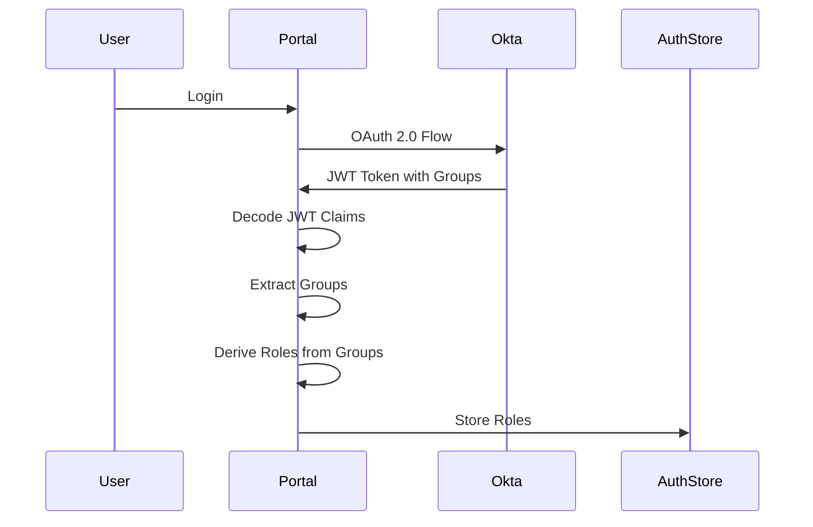

# RBAC Implementation Summary

## Overview

The portal has been updated to use **OAuth 2.0 JWT tokens** with **role-based access control (RBAC)** where **roles are derived from groups**. Groups from JWT claims have a direct relationship to roles in both the portal and remote packages. Only remote packages that the authenticated user has required roles for are shown in the portal central hub.

## Implementation Details

### ✅ Portal Authentication

- **OAuth 2.0**: Portal uses Okta OAuth 2.0 for authentication
- **JWT Tokens**: Access tokens are JWT format
- **Group Extraction**: Groups are extracted from JWT claims (`claims.groups`)
- **Role Derivation**: Roles are derived from groups using `GROUP_TO_ROLE_MAP`
- **Scope Request**: Okta configuration requests `groups` scope

### ✅ RBAC Authorization

- **Role-Based**: Authorization is based on roles derived from groups
- **Group-to-Role Mapping**: Groups from JWT are mapped to roles
- **Module Filtering**: Only modules user has roles for are shown
- **Route Protection**: Routes are protected by role requirements
- **Dynamic Visibility**: Sidebar and Dashboard filter by roles

### ✅ Remote Package Awareness

- **Props Injection**: Remotes receive roles (derived from groups) via props
- **JWT Claims**: Full JWT claims (including groups) are passed to remotes
- **Role Helpers**: Remotes receive `hasRole()`, `hasAnyRole()`, `hasAllRoles()` helpers
- **Authorization**: Remotes can use roles for internal authorization
- **Group Relationship**: Remotes understand groups have direct relationship to roles

## Changes Made

### 1. AuthStore Updates

**File**: `packages/portal/src/stores/AuthStore.ts`

- ✅ Added `roles: string[]` property to store roles derived from groups
- ✅ Extract groups from JWT claims: `this.groups = this.claims.groups || []`
- ✅ Derive roles from groups: `this.roles = deriveRolesFromGroups(this.groups)`
- ✅ Added `hasAnyRole()` method
- ✅ Added `hasAllRoles()` method
- ✅ Updated `hasRole()` to use stored roles array

### 2. Okta Configuration

**File**: `packages/portal/src/config/oktaConfig.ts`

- ✅ Requests `'groups'` scope: `scopes: ['openid', 'profile', 'email', 'groups']`
- ✅ Added `GROUP_TO_ROLE_MAP` to map groups to roles:
  ```typescript
  'trade-planners': ['trader'],
  'compliance-officers': ['compliance-officer'],
  'admins': ['admin'],
  // ...
  ```
- ✅ Added `deriveRolesFromGroups()` function
- ✅ Updated `MODULE_ACCESS` to use roles (derived from groups):
  ```typescript
  tradePlans: ['trader', 'trade-manager', 'admin']
  clientVerification: ['compliance-officer', 'kyc-specialist', 'admin']
  annuitySales: ['sales-agent', 'sales-manager', 'admin']
  ```

### 3. ModuleLoader Updates

**File**: `packages/portal/src/components/ModuleLoader.tsx`

- ✅ Added `requiredRoles` prop
- ✅ Role-based authorization check (primary)
- ✅ Group-based fallback (legacy support)
- ✅ Inject roles (derived from groups) into remote props:
  ```typescript
  auth: {
    groups: authStore.groups, // Groups from JWT claims
    roles: authStore.roles, // Roles derived from groups
    hasRole: (role: string) => authStore.hasRole(role),
    hasAnyRole: (roles: string[]) => authStore.hasAnyRole(roles),
    hasAllRoles: (roles: string[]) => authStore.hasAllRoles(roles),
  }
  ```

### 4. Sidebar Updates

**File**: `packages/portal/src/components/Layout/Sidebar.tsx`

- ✅ Updated to use `requiredRoles` instead of `requiredGroups`
- ✅ Filter nav items by roles: `authStore.hasAnyRole(item.requiredRoles)`
- ✅ Only show modules user has roles for

### 5. Dashboard Updates

**File**: `packages/portal/src/pages/Dashboard.tsx`

- ✅ Updated modules to use `requiredRoles`
- ✅ Filter accessible modules by roles: `authStore.hasAnyRole(module.requiredRoles)`
- ✅ Only show modules user has roles for

### 6. App Routes Updates

**File**: `packages/portal/src/App.tsx`

- ✅ Updated routes to use `requiredRoles` instead of `requiredGroups`
- ✅ ModuleLoader receives `requiredRoles` prop

### 7. SecureRoute Updates

**File**: `packages/portal/src/components/Auth/SecureRoute.tsx`

- ✅ Prioritizes role-based authorization
- ✅ Falls back to groups if no roles specified (legacy support)

### 8. Shared Types Updates

**File**: `packages/shared/src/types/auth.types.ts`

- ✅ Added `roles?: string[]` to `AuthState`
- ✅ Added `hasAnyRole()` and `hasAllRoles()` helpers
- ✅ Updated comments to clarify roles are primary RBAC mechanism

### 9. Remote Module Example

**File**: `packages/trade-plans/src/App.tsx`

- ✅ Updated to use roles instead of groups
- ✅ Shows roles from JWT claims
- ✅ Uses `hasRole()` for authorization

## JWT Token Structure

### Required Claims

```json
{
  "sub": "user-123",
  "email": "user@example.com",
  "name": "John Doe",
  "groups": ["trade-planners", "admins"], // Required - used to derive roles
  "exp": 1234567890,
  "iat": 1234567890
}
```

**Note:** JWT tokens do NOT have a `roles` claim. Roles are derived from groups.

## Group-to-Role Configuration

### Group-to-Role Mapping

```typescript
export const GROUP_TO_ROLE_MAP: Record<string, string[]> = {
  'trade-planners': ['trader'],
  'traders': ['trader'],
  'trade-managers': ['trade-manager'],
  'compliance-officers': ['compliance-officer'],
  'kyc-specialists': ['kyc-specialist'],
  'sales-agents': ['sales-agent'],
  'sales-managers': ['sales-manager'],
  'admins': ['admin'],
}
```

### Module Access Roles

```typescript
export const MODULE_ACCESS = {
  tradePlans: ['trader', 'trade-manager', 'admin'],
  clientVerification: ['compliance-officer', 'kyc-specialist', 'admin'],
  annuitySales: ['sales-agent', 'sales-manager', 'admin'],
}
```

### Okta Setup Required

1. **Configure Groups** in Okta Admin Console:
   - `trade-planners`, `traders`, `trade-managers`
   - `compliance-officers`, `kyc-specialists`
   - `sales-agents`, `sales-managers`
   - `admins`

2. **Assign Users** to groups

3. **Add Custom Claim** for groups in Authorization Server:
   ```json
   {
     "name": "groups",
     "value": "user.groups",
     "type": "Expression",
     "valueType": "GROUPS"
   }
   ```

4. **Request Groups Scope** in OAuth flow (already configured)

## How It Works

### 1. User Authentication



### 2. Module Visibility

```typescript
// Sidebar filters modules by roles (derived from groups)
const visibleNavItems = navItems.filter(item => {
  if (!item.requiredRoles || item.requiredRoles.length === 0) {
    return true // No requirements = show to all
  }
  return authStore.hasAnyRole(item.requiredRoles) // Check derived roles
})
```

### 3. Route Protection

```typescript
// Routes are protected by roles
<SecureRoute requiredRoles={MODULE_ACCESS.tradePlans}>
  <ModuleLoader requiredRoles={MODULE_ACCESS.tradePlans} />
</SecureRoute>
```

### 4. Remote Access

```typescript
// Remotes receive roles (derived from groups) via props
export default function App(props: AppProps = {}) {
  const { auth } = props
  const groups = auth?.groups || [] // Groups from JWT claims
  const roles = auth?.roles || [] // Roles derived from groups
  
  // Use roles for authorization (groups → roles → authorization)
  if (auth?.hasRole?.('trader')) {
    // Show trader features
  }
}
```

## Example Scenarios

### Scenario 1: Trader User

**JWT Claims:**
```json
{
  "groups": ["trade-planners"]
}
```

**Group-to-Role Mapping:**
- `trade-planners` → `['trader']`

**Derived Roles:** `['trader']`

**Portal Shows:**
- ✅ Dashboard
- ✅ Trade Plans (has `trader` role derived from `trade-planners` group)
- ❌ Client Verification (no `compliance-officer` role)
- ❌ Annuity Sales (no `sales-agent` role)

### Scenario 2: Admin User

**JWT Claims:**
```json
{
  "groups": ["admins"]
}
```

**Group-to-Role Mapping:**
- `admins` → `['admin']`

**Derived Roles:** `['admin']`

**Portal Shows:**
- ✅ Dashboard
- ✅ Trade Plans (has `admin` role derived from `admins` group)
- ✅ Client Verification (has `admin` role)
- ✅ Annuity Sales (has `admin` role)

### Scenario 3: Multi-Group User

**JWT Claims:**
```json
{
  "groups": ["trade-planners", "compliance-officers"]
}
```

**Group-to-Role Mapping:**
- `trade-planners` → `['trader']`
- `compliance-officers` → `['compliance-officer']`

**Derived Roles:** `['trader', 'compliance-officer']`

**Portal Shows:**
- ✅ Dashboard
- ✅ Trade Plans (has `trader` role derived from `trade-planners` group)
- ✅ Client Verification (has `compliance-officer` role derived from `compliance-officers` group)
- ❌ Annuity Sales (no `sales-agent` role)

## Remote Package Usage

### Receiving Roles

```typescript
// Remote receives roles (derived from groups) from portal via props
export default function App(props: AppProps = {}) {
  const { auth } = props
  
  // Groups from JWT claims
  const groups = auth?.groups || [] // ['trade-planners', 'admins']
  // Roles derived from groups in portal
  const roles = auth?.roles || [] // ['trader', 'admin']
  
  // Use roles for authorization (groups → roles → authorization)
  const canCreate = auth?.hasRole?.('trader')
  const canViewAnalytics = auth?.hasRole?.('admin')
}
```

### Using Roles for Authorization

```typescript
// Example: Role-based feature access
function TradeList({ auth }: { auth?: AuthState }) {
  const canEdit = auth?.hasRole?.('trader') || auth?.hasRole?.('admin')
  const canDelete = auth?.hasRole?.('admin')
  
  return (
    <div>
      {trades.map(trade => (
        <TradeCard
          key={trade.id}
          trade={trade}
          canEdit={canEdit}
          canDelete={canDelete}
        />
      ))}
    </div>
  )
}
```

## Security Considerations

### ✅ Implemented

- JWT tokens validated by Okta SDK
- Groups extracted from server-validated JWT claims
- Roles derived from groups using `GROUP_TO_ROLE_MAP`
- Role-based authorization for module visibility
- Role-based route protection
- Roles passed to remotes for internal authorization

### ⚠️ Important Notes

- **JWT Contains Groups**: JWT tokens contain groups, not roles
- **Roles Are Derived**: Roles are derived from groups client-side
- **Client-Side Checks**: Role checks in portal are for UX only
- **Server-Side Validation**: Always validate groups server-side for API calls
- **Token Security**: Tokens stored securely (localStorage)
- **Token Refresh**: Handled automatically by Okta SDK

## Testing

### Mock Users with Groups

```typescript
const mockUsers = {
  'trader@example.com': {
    groups: ['trade-planners'], // Groups in JWT
    // Roles will be derived: ['trader']
  },
  'admin@example.com': {
    groups: ['admins'], // Groups in JWT
    // Roles will be derived: ['admin']
  },
  'multi-group@example.com': {
    groups: ['trade-planners', 'compliance-officers'], // Groups in JWT
    // Roles will be derived: ['trader', 'compliance-officer']
  }
}
```

## Migration Notes

### Backward Compatibility

- ✅ Groups still supported (legacy fallback)
- ✅ `MODULE_ACCESS_GROUPS` available for migration
- ✅ `requiredGroups` still works if `requiredRoles` not specified

### Migration Path

1. **Configure Okta**: Set up roles in Okta
2. **Update JWT Claims**: Add roles to token claims
3. **Update Code**: Use `requiredRoles` instead of `requiredGroups`
4. **Test**: Verify role-based access works
5. **Deprecate**: Remove group-based access after migration

## Documentation

- **[RBAC with JWT Roles Guide](./rbac-jwt-roles-guide.md)** - Complete guide
- **[Security & Authentication Guide](./security-authentication-guide.md)** - Auth setup
- **[State Management Guide](./state-management-guide.md)** - How roles flow to remotes

## Summary

✅ **Portal uses OAuth 2.0 JWT tokens** for authentication  
✅ **Groups from JWT claims** are mapped to roles  
✅ **Roles are derived from groups** using `GROUP_TO_ROLE_MAP`  
✅ **Groups have direct relationship** to roles in portal and remotes  
✅ **Only authorized modules** are shown in portal  
✅ **Remotes receive roles** (derived from groups) via props injection  
✅ **Remotes can use roles** for internal authorization  

## Key Points

1. **JWT tokens contain groups** (not roles)
2. **Groups are mapped to roles** using `GROUP_TO_ROLE_MAP`
3. **Roles are derived** from groups for RBAC
4. **Groups have direct relationship** to roles in portal and remotes
5. **Both portal and remotes** use roles for authorization

---

**Implementation Completed:** 2024  
**Status:** ✅ Ready for Production

