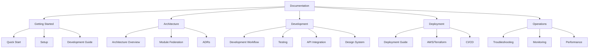

# Documentation

Welcome to the Enterprise Portal with Micro-Frontend Architecture documentation. This documentation is organized to help you quickly find what you need, whether you're a developer, architect, or DevOps engineer.

## 📚 Documentation Structure

### 🚀 Getting Started

- **[Quick Start Guide](./getting-started.md)** - Get up and running in 5 minutes
- **[Local Development Guide](./local-development-guide.md)** - Run locally without Okta setup
- **[Setup Instructions](./setup-instructions.md)** - Detailed setup guide
- **[Development Guide](./development-guide.md)** - Complete development workflow

### 🏗️ Architecture

- **[Architecture Overview](./architecture-overview.md)** - System architecture with diagrams
- **[Module Federation Guide](./module-federation-guide.md)** - Technical deep dive
- **[Architecture Decision Records (ADRs)](./adr/README.md)** - Key architectural decisions

### 💻 Development

- **[Development Guide](./development-guide.md)** - Local development workflow
- **[State Management Guide](./state-management-guide.md)** - State management across microfrontends
- **[Testing Guide](./testing-guide.md)** - Testing strategies and examples
- **[Mocking Guide](./mocking-guide.md)** - Mock services for development
- **[API Integration Guide](./api-integration-guide.md)** - API client patterns

### 🎨 Design & UI

- **[Design System](./design-system.md)** - Component library and guidelines
- **[Component Reference](./component-reference.md)** - Available components

### 🔐 Security

- **[Security & Authentication Guide](./security-authentication-guide.md)** - Okta setup and security
- **[RBAC with JWT Roles Guide](./rbac-jwt-roles-guide.md)** - Role-based access control using JWT claims
- **[Security Best Practices](./security-best-practices.md)** - Security guidelines

### 🚢 Deployment

- **[Deployment Guide](./deployment-guide.md)** - Production deployment
- **[Independent Deployment Guide](./independent-deployment-guide.md)** - Deploy packages separately
- **[AWS & Terraform Guide](./aws-terraform-cloud.md)** - Infrastructure as code
- **[CI/CD Guide](./cicd-guide.md)** - Continuous integration and deployment

### 🛠️ Operations

- **[Troubleshooting Guide](./troubleshooting-guide.md)** - Common issues and solutions
- **[Monitoring Guide](./monitoring-guide.md)** - Observability and monitoring
- **[Performance Guide](./performance-guide.md)** - Optimization strategies

### 📖 Reference

- **[API Reference](./api-reference.md)** - API documentation
- **[Configuration Reference](./configuration-reference.md)** - All configuration options
- **[Glossary](./glossary.md)** - Terms and concepts

## 🎯 Quick Navigation by Role

### New Developer
1. [Quick Start Guide](./getting-started.md) (5 min)
2. [Development Guide](./development-guide.md) (30 min)
3. [Architecture Overview](./architecture-overview.md) (20 min)
4. [Module Federation Guide](./module-federation-guide.md) (30 min)

### Frontend Developer
1. [Development Guide](./development-guide.md)
2. [Design System](./design-system.md)
3. [Testing Guide](./testing-guide.md)
4. [Component Reference](./component-reference.md)

### Backend/API Developer
1. [API Integration Guide](./api-integration-guide.md)
2. [API Reference](./api-reference.md)
3. [Security Guide](./security-authentication-guide.md)

### DevOps Engineer
1. [Deployment Guide](./deployment-guide.md)
2. [AWS & Terraform Guide](./aws-terraform-cloud.md)
3. [CI/CD Guide](./cicd-guide.md)
4. [Monitoring Guide](./monitoring-guide.md)

### Architect/Tech Lead
1. [Architecture Overview](./architecture-overview.md)
2. [Architecture Decision Records](./adr/README.md)
3. [Module Federation Guide](./module-federation-guide.md)
4. [Performance Guide](./performance-guide.md)

## 📊 Documentation Map

## 🔍 Finding Information

### By Topic

**Module Federation**
- [Module Federation Guide](./module-federation-guide.md) - Complete technical guide
- [Architecture Overview - Module Federation](./architecture-overview.md#module-federation-architecture) - High-level overview
- [ADR-0001: Module Federation Implementation](./adr/0001-module-federation-vite-implementation.md) - Decision record

**Authentication**
- [Security & Authentication Guide](./security-authentication-guide.md) - Complete guide
- [Development Guide - Authentication](./development-guide.md#authentication) - Development setup
- [ADR-0002: Token Sharing](./adr/0002-token-sharing-props-injection.md) - Architecture decision

**Testing**
- [Testing Guide](./testing-guide.md) - How to write and run tests
- [Testing Strategy](./testing-strategy.md) - Testing philosophy
- [Development Guide - Testing](./development-guide.md#testing) - Quick reference

**Deployment**
- [Deployment Guide](./deployment-guide.md) - Production deployment
- [AWS & Terraform Guide](./aws-terraform-cloud.md) - Infrastructure setup
- [CI/CD Guide](./cicd-guide.md) - Automated deployments

### By Problem

**"I can't get started"**
→ [Quick Start Guide](./getting-started.md)

**"Module won't load"**
→ [Troubleshooting Guide - Module Federation](./troubleshooting-guide.md#module-federation-issues)

**"How do I add a new remote?"**
→ [Development Guide - Adding Modules](./development-guide.md#adding-a-new-remote-module)

**"How does authentication work?"**
→ [Security & Authentication Guide](./security-authentication-guide.md)

**"How do I deploy?"**
→ [Deployment Guide](./deployment-guide.md)

## 📝 Documentation Standards

### Writing Guidelines

1. **Be Clear and Concise** - Get to the point quickly
2. **Use Examples** - Show, don't just tell
3. **Include Diagrams** - Visual aids help understanding
4. **Keep Updated** - Update docs when code changes
5. **Cross-Reference** - Link to related docs

### Code Examples

All code examples should:
- Be complete and runnable
- Include necessary imports
- Show both TypeScript types and runtime behavior
- Include error handling where relevant

### Diagrams

We use Mermaid for diagrams:
- Architecture diagrams
- Flow charts
- Sequence diagrams
- State diagrams

## 🔄 Keeping Documentation Updated

When making changes:

1. **Update relevant docs** - If you change code, update docs
2. **Update examples** - Ensure code examples still work
3. **Update diagrams** - Keep architecture diagrams current
4. **Check cross-references** - Update links if files move
5. **Update CHANGELOG** - Document significant changes

## 📚 Additional Resources

### External Documentation

- [Vite Documentation](https://vitejs.dev/)
- [Module Federation Guide](https://module-federation.github.io/)
- [MobX Documentation](https://mobx.js.org/)
- [React Router v6](https://reactrouter.com/)
- [Tailwind CSS](https://tailwindcss.com/)
- [Okta React SDK](https://github.com/okta/okta-react)

### Internal Resources

- [Project README](../README.md) - Project overview
- [CONTRIBUTING.md](../CONTRIBUTING.md) - Contribution guidelines
- [CHANGELOG.md](../CHANGELOG.md) - Version history
- [SECURITY.md](../SECURITY.md) - Security policy

## 🆘 Getting Help

1. **Check Documentation** - Search this index first
2. **Check Troubleshooting Guide** - Common issues and solutions
3. **Check GitHub Issues** - See if your issue is already reported
4. **Ask the Team** - Reach out on Slack/Teams
5. **Create an Issue** - If you find a bug or need a feature

## 📅 Documentation Status

| Document | Status | Last Updated |
|----------|--------|-------------|
| Quick Start | ✅ Complete | 2024 |
| Architecture Overview | ✅ Complete | 2024 |
| Development Guide | ✅ Complete | 2024 |
| Module Federation Guide | ✅ Complete | 2024 |
| Deployment Guide | ✅ Complete | 2024 |
| Testing Guide | ✅ Complete | 2024 |
| Troubleshooting Guide | ✅ Complete | 2024 |

---

**Last Updated:** 2024  
**Maintained by:** Development Team  
**Feedback:** Please create an issue or PR for documentation improvements
