# Architecture Overview

This document provides a comprehensive overview of the Enterprise Portal micro-frontend architecture, including system design, component interactions, and deployment structure.

## Table of Contents

1. [System Architecture](#system-architecture)
2. [Monorepo Structure](#monorepo-structure)
3. [Module Federation Architecture](#module-federation-architecture)
4. [Authentication Flow](#authentication-flow)
5. [State Management](#state-management)
6. [Routing Strategy](#routing-strategy)
7. [Deployment Architecture](#deployment-architecture)
8. [Communication Patterns](#communication-patterns)
9. [Error Handling](#error-handling)
10. [Performance Considerations](#performance-considerations)
11. [Security Architecture](#security-architecture)
12. [Scalability](#scalability)

## System Architecture

The Enterprise Portal uses a **micro-frontend architecture** with **Module Federation** to enable independently deployable sub-applications.

### High-Level Architecture

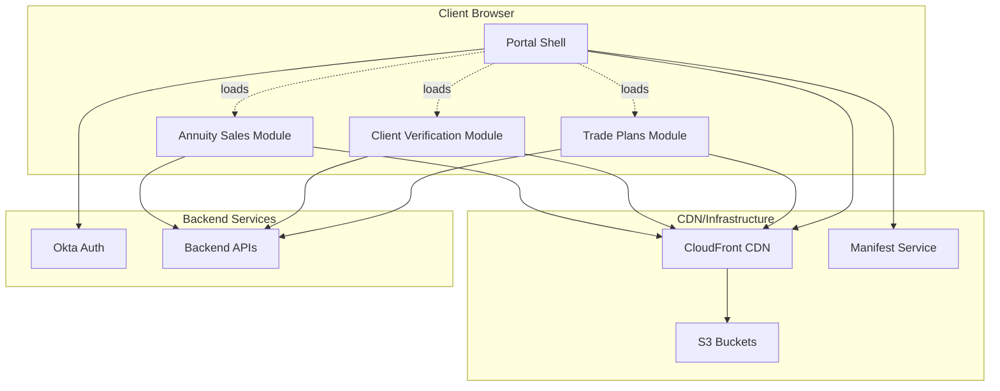

### Component Overview

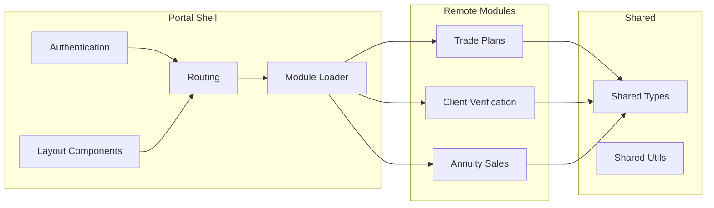

## Monorepo Structure

All packages live in a single **pnpm workspace**, enabling:
- Shared tooling and dependencies
- Instant cross-package linking
- Coordinated builds
- Independent deployment

### Workspace Structure

```
packages/
├── portal/                    # Host shell application
│   ├── Authentication (Okta)
│   ├── Layout & Navigation
│   ├── Module Loader
│   └── Shared State Management
│
├── trade-plans/              # Remote module 1
│   ├── Trade Management
│   ├── Strategy Builder
│   └── Analytics
│
├── client-verification/      # Remote module 2
│   ├── Verification Queue
│   ├── Document Management
│   └── Compliance Checks
│
├── annuity-sales/            # Remote module 3
│   ├── Product Catalog
│   ├── Quote Calculator
│   └── Sales Pipeline
│
└── shared/                   # Shared code
    ├── types/                # TypeScript types
    └── utils/                # Utility functions
```

### Package Dependencies

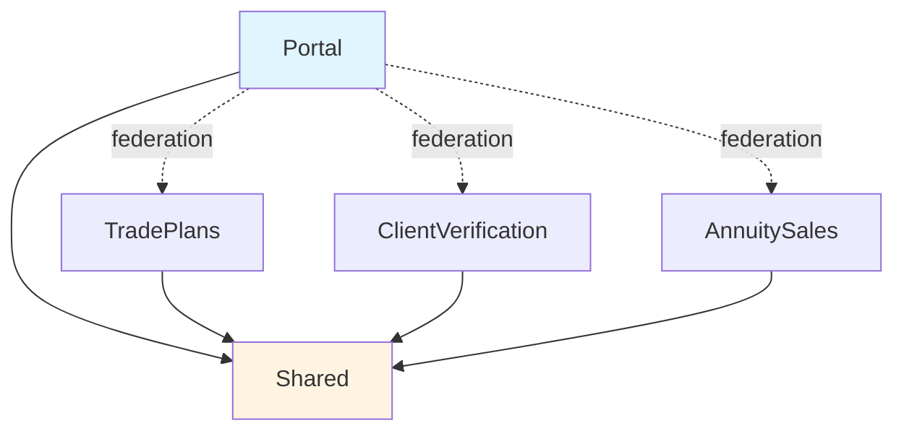

## Module Federation Architecture

### How Module Federation Works

Module Federation enables runtime module loading and sharing:

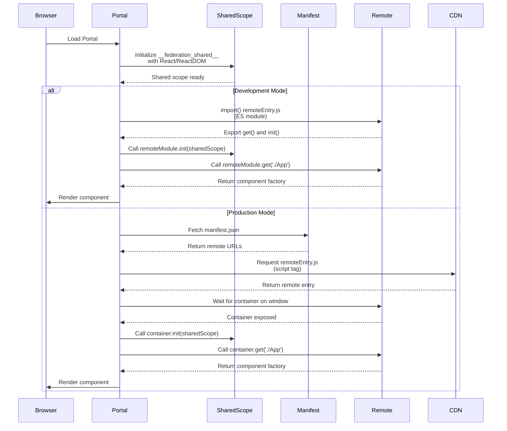

### Shared Dependencies

All modules share these dependencies (loaded once):

- `react` (^18.2.0)
- `react-dom` (^18.2.0)
- `mobx` (^6.12.0)
- `mobx-react-lite` (^4.0.0)
- `react-router-dom` (^6.20.0)

**Benefits:**
- ✅ Single instance of React across all modules
- ✅ Consistent state management
- ✅ Shared routing context
- ✅ Smaller bundle sizes

**Critical Implementation Detail:**

Shared dependencies must be initialized in `__federation_shared__` **before** any remote modules load. This is done in `main.tsx`:

```typescript
// Portal main.tsx - Initialize BEFORE ReactDOM.render()
function initializeFederationSharedScope() {
  const sharedScope = (window as any).__federation_shared__ || {}
  sharedScope.default = sharedScope.default || {}
  
  // React structure: get() returns Promise<() => Promise<React>>
  sharedScope.default.react = {
    '18.2.0': {
      get: () => Promise.resolve(() => Promise.resolve(React)),
      loaded: true,
      from: 'portal'
    }
  }
  // Same for react-dom...
}

initializeFederationSharedScope() // Call immediately
```

**Why?** Remote modules access React via the shared scope. If React isn't initialized before the remote loads, you'll get "React is null" errors.

### Module Loading Flow

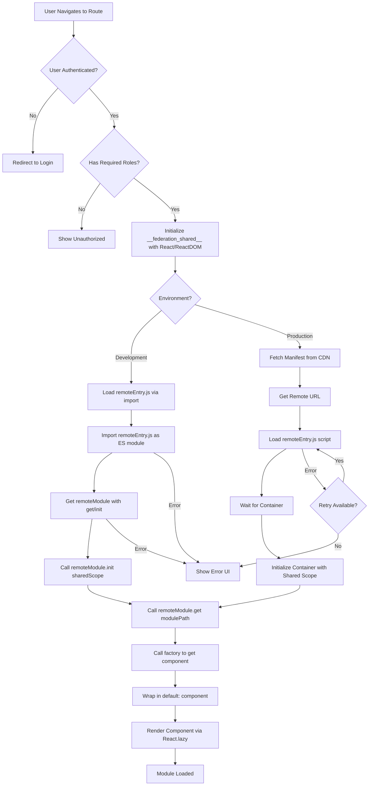

## Authentication Flow

### Authentication Sequence

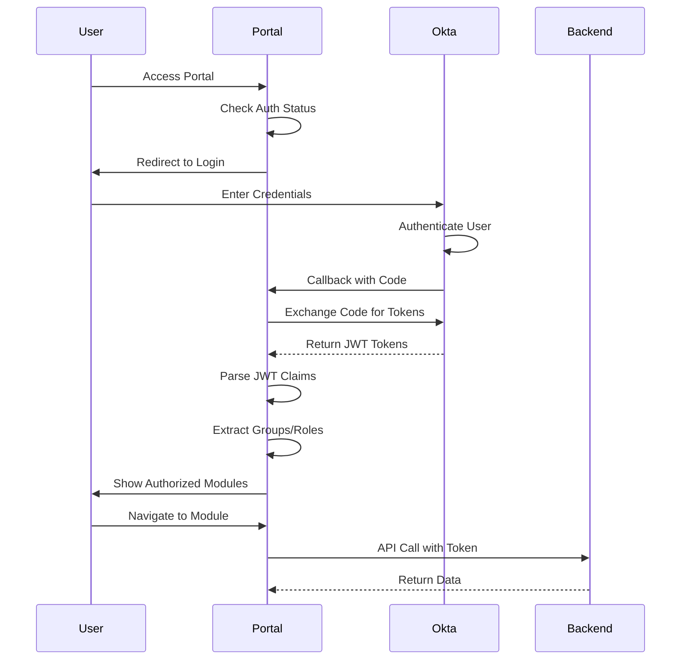

### Token Management

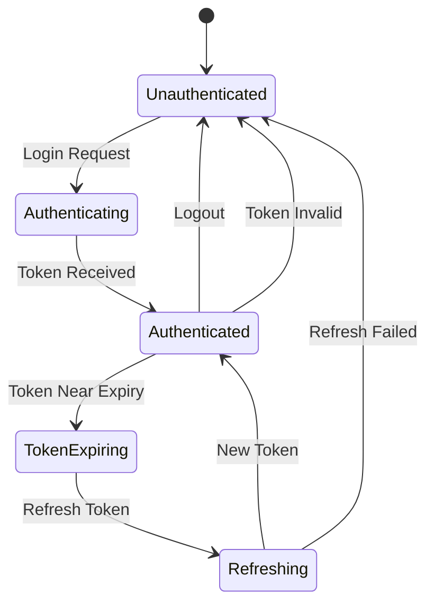

## State Management

### State Architecture

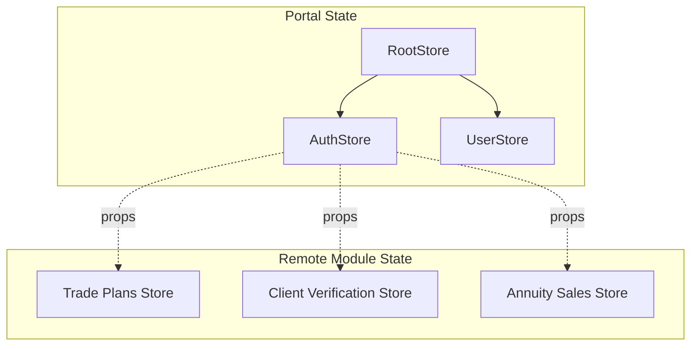

### State Sharing Strategy

**Props Injection** (Recommended - See [ADR-0002](./adr/0002-token-sharing-props-injection.md))

The portal injects authentication state into remotes via props:

```typescript
// Portal passes auth state
<ModuleLoader 
  remoteName="tradePlans"
  module="./App"
  props={{
    auth: {
      user: authStore.claims,
      token: authStore.accessToken,
      groups: authStore.groups,
      isAuthenticated: authStore.isAuthenticated,
      hasGroup: (group: string) => authStore.hasGroup(group),
    },
    onLogout: () => authStore.logout(),
  }}
/>
```

**Benefits:**
- ✅ Type-safe interface
- ✅ Explicit dependencies
- ✅ Works in standalone mode
- ✅ No global state pollution

## Routing Strategy

### Portal Routes

```
/                          → Dashboard (if exists)
/login                     → Login page
/login/callback            → Okta callback handler
/unauthorized              → Access denied page
/trade-plans/*             → Trade Plans module (lazy loaded)
/client-verification/*     → Client Verification module (lazy loaded)
/annuity-sales/*           → Annuity Sales module (lazy loaded)
```

### Remote Module Routes

Each remote module manages its own internal routing:

- **Trade Plans**: `/trade-plans/`, `/trade-plans/strategies`, `/trade-plans/analytics`
- **Client Verification**: `/client-verification/`, `/client-verification/queue`, `/client-verification/profile/:id`
- **Annuity Sales**: `/annuity-sales/`, `/annuity-sales/products`, `/annuity-sales/quotes`

### Routing Flow

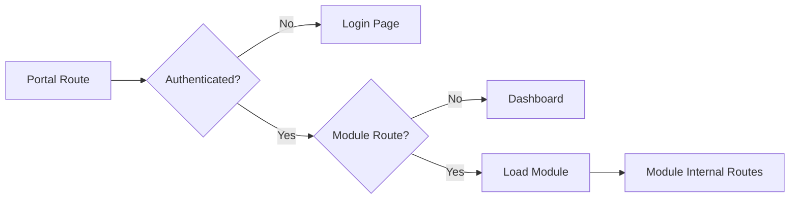

## Deployment Architecture

### S3/CDN Structure

```
s3://bucket/
├── portal/
│   ├── v1.0.0/              # Versioned deployment
│   ├── v1.1.0/
│   └── current/ → v1.1.0/   # Latest version symlink
│
├── trade-plans/
│   ├── v1.0.0/
│   └── current/ → v1.0.0/
│
├── client-verification/
│   ├── v1.0.0/
│   └── current/ → v1.0.0/
│
├── annuity-sales/
│   ├── v1.0.0/
│   └── current/ → v1.0.0/
│
└── manifest.json            # Remote module registry
```

### Deployment Flow

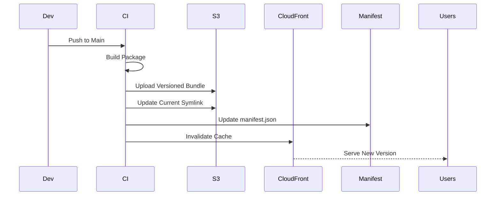

### Version Management

- Each module versions independently
- `current` symlink points to latest version
- Portal fetches `manifest.json` to discover available versions
- Supports A/B testing and gradual rollouts

## Communication Patterns

### Portal → Remote

1. **Props Injection** - Pass auth state, user info, callbacks
2. **Events** - Custom events for cross-module communication
3. **Shared State** - Via shared MobX stores (if using shared package)

### Remote → Portal

1. **Callbacks** - Functions passed as props
2. **Events** - Custom events dispatched to window
3. **Navigation** - Use React Router's `useNavigate` (shared context)

### Communication Diagram

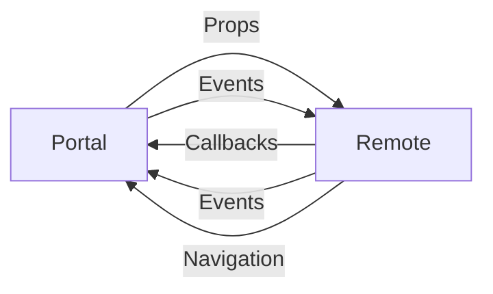

## Error Handling

### Error Handling Strategy

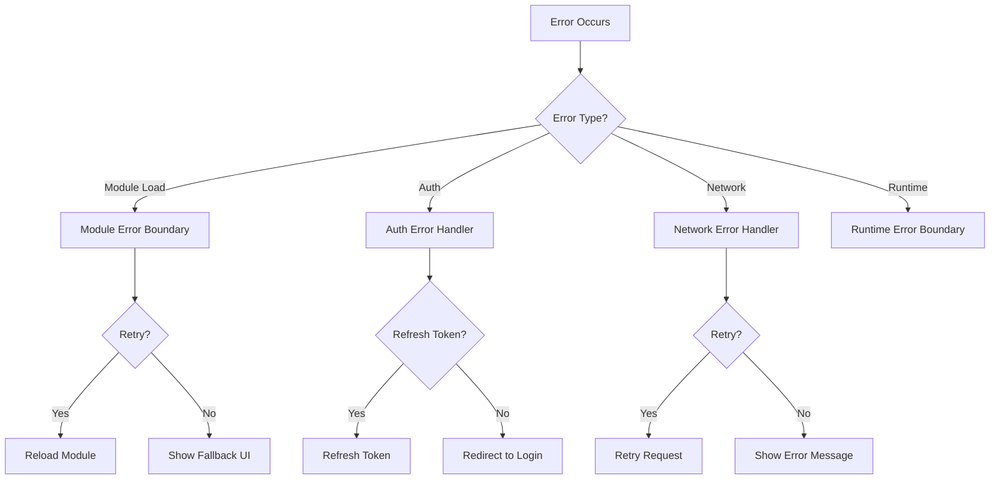

### Error Boundaries

- **Module Loading Errors** - Error boundaries catch remote loading failures
- **Authentication Errors** - Token expiration → Auto-refresh or redirect to login
- **Network Errors** - Show retry option with exponential backoff

## Performance Considerations

### Performance Optimizations

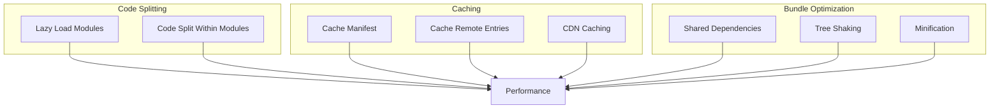

### Performance Metrics

- **Module Load Times** - Target: < 2s for initial load
- **Time to Interactive** - Target: < 3s
- **Bundle Sizes** - Portal: < 500KB, Remotes: < 300KB each
- **Cache Hit Rate** - Target: > 80% for static assets

## Security Architecture

### Security Layers

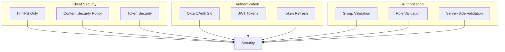

### Security Considerations

1. **CORS** - Proper CORS configuration for remote modules
2. **Content Security Policy** - CSP headers for XSS protection
3. **Token Security** - Tokens stored securely, not exposed unnecessarily
4. **HTTPS** - All communication over HTTPS
5. **Group Validation** - Server-side validation of group membership

## Scalability

### Adding New Modules

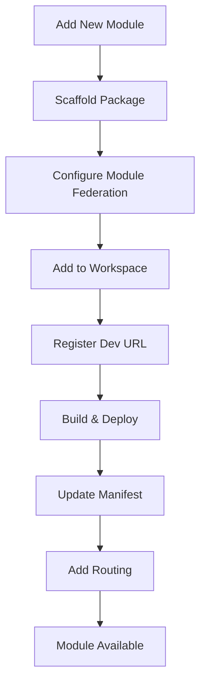

### Module Updates

- Deploy new version
- Update manifest.json
- Portal loads new version on next navigation
- Old version remains available for rollback

### Horizontal Scaling

- Each module can scale independently
- CDN provides global distribution
- No shared server infrastructure required
- Stateless architecture enables easy scaling

## Technology Stack

### Core Technologies

- **React 18.2+** - UI framework with concurrent features
- **TypeScript** - Type safety across all modules
- **Vite 5+** - Fast build tool and dev server
- **MobX 6+** - Reactive state management
- **Module Federation** - Micro-frontend architecture via `@originjs/vite-plugin-federation`
- **React Router v6** - Client-side routing
- **Tailwind CSS** - Utility-first styling

### Authentication & Security

- **Okta React SDK** - OAuth 2.0 authentication
- **JWT Tokens** - Access token management
- **Role-Based Access Control (RBAC)** - Group and role-based permissions

## Monitoring & Observability

### Recommended Metrics

- Module load times
- Authentication success/failure rates
- Module error rates
- User navigation patterns
- API response times

### Logging

- Client-side error logging
- Authentication events
- Module load events
- User actions (for audit trail)

## Related Documentation

- [Module Federation Guide](./module-federation-guide.md) - Technical deep dive
- [Development Guide](./development-guide.md) - Development workflow
- [Deployment Guide](./deployment-guide.md) - Production deployment
- [Architecture Decision Records](./adr/README.md) - Key decisions
- [Security Guide](./security-authentication-guide.md) - Security details

---

**Last Updated:** 2024  
**Maintained by:** Architecture Team
