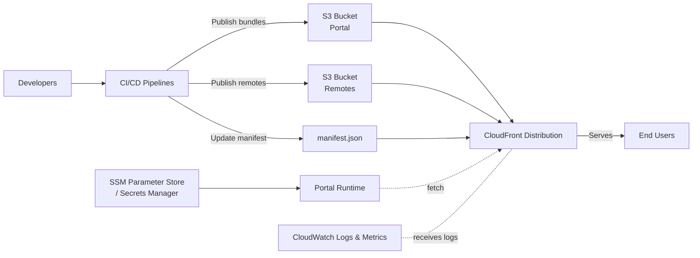
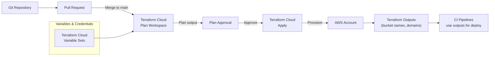

# AWS Deployment with Terraform Cloud

This guide describes how to provision the hosting platform for the React Federation monorepo using **AWS** infrastructure managed through **Terraform Cloud (TFC)**. It assumes the application artifacts (portal host and remotes) are built by CI pipelines and published to AWS.

---

## 1. Target Architecture

| Layer | AWS Services | Notes |
| --- | --- | --- |
| Static hosting | Amazon S3 (per app + per environment) | Stores the portal bundle, each remote’s `remoteEntry.js`, and shared assets. |
| Global delivery | Amazon CloudFront | One distribution per environment; routes `/portal`, `/manifest.json`, `/remotes/...` with cache policies tuned for module federation. |
| Auth & secrets | AWS Systems Manager Parameter Store / AWS Secrets Manager | Stores Okta client IDs, API endpoints, environment flags consumed at runtime. |
| Observability | Amazon CloudWatch | Access logs from CloudFront/S3, alarms on 4xx/5xx spikes, manifests fetch failures. |
| Optional APIs | Amazon API Gateway + AWS Lambda (or existing services) | Backing APIs called by the portal/remotes; provision separately or integrate as modules. |

### Diagram: High-Level Hosting Architecture



Key requirements for module federation:
- S3 buckets must support versioned uploads and public read via CloudFront origin access control.
- The `manifest.json` object requires `Cache-Control: no-cache, no-store, must-revalidate`.
- Each remote publishes to its own S3 prefix (e.g. `s3://cdn-bucket/trade-plans/<version>/`).

---

## 2. Terraform Cloud Strategy

### 2.1 Organization & Workspaces

| Workspace | Purpose | Run Mode |
| --- | --- | --- |
| `react-federation-networking` | Shared VPC, security groups (if APIs hosted privately). | Remote |
| `react-federation-platform-dev` | S3 buckets, CloudFront, Parameter Store for development. | Remote |
| `react-federation-platform-stg` | Same as dev, targeting staging account/Region. | Remote |
| `react-federation-platform-prod` | Production infra w/ stricter policies & WAF. | Remote |

Recommended TFC settings:
- **VCS-driven runs**: Connect each workspace to the repo; trigger on `main` or environment-specific branches.
- **Variable sets**: Store shared variables (Okta issuer, Terraform Cloud tokens, AWS assume-role ARNs).
- **Run tasks**: Integrate security scanning (e.g. Checkov) or policy-as-code (Sentinel) for compliance.

### 2.2 State & Permissions

- Use **Terraform Cloud remote state** with state sharing between workspaces where needed (e.g. platform workspaces can read networking outputs via data sources).
- Configure **AWS IAM roles** per workspace; Terraform Cloud assumes the role to deploy infra. Set `AWS_ACCESS_KEY_ID`, `AWS_SECRET_ACCESS_KEY`, and `AWS_SESSION_TOKEN` as TFC environment variables (or use OIDC provider for short-lived creds).

### Diagram: Terraform Cloud Workflow



---

## 3.1 CloudFront & Route 53 (Multiple S3 Buckets)

When each remote owns a dedicated S3 bucket, configure a single CloudFront distribution with multiple origins and path-based behaviours:

| Path pattern | Origin | Purpose |
| --- | --- | --- |
| `/`, `/index.html` | `origin_portal` → portal bucket | Default behaviour serving the portal shell. |
| `/assets/*` | `origin_portal` | Portal static assets (long-lived cache). |
| `/manifest.json` | `origin_manifest` (portal bucket or dedicated config bucket) | Behaviour with caching disabled to ensure fresh remote mappings. |
| `/remotes/trade-plans/*` | `origin_trade_plans` → trade-plans bucket | Serves Trade Plans `remoteEntry.js` and assets. |
| `/remotes/client-verification/*` | `origin_client_verification` → client-verification bucket | Serves Client Verification bundles. |
| `/remotes/annuity-sales/*` | `origin_annuity_sales` → annuity-sales bucket | Serves Annuity Sales bundles. |

Key details:
- Attach **Origin Access Control (OAC)** (or legacy OAI) to every bucket so content is only reachable through CloudFront.
- Use managed cache policies (e.g. `Managed-CachingOptimized`) for remote bundles while restricting HTTP methods to `GET` and `HEAD`.
- Optional Lambda@Edge / CloudFront Functions can add security headers or advanced rewrites.

### Route 53 DNS

1. Issue an ACM certificate in `us-east-1` for `portal.example.com` (and optionally `*.portal.example.com`).
2. Create an alias A/AAAA record pointing to the CloudFront domain:
   ```
   portal.example.com.  A (Alias) → dXXXXXXXXXXXXX.cloudfront.net.
   ```
3. Manifest entries reference the same host (`https://portal.example.com/remotes/...`), so users see a single domain while CloudFront routes requests to the correct origin.

This design lets each remote publish to its own bucket but keeps a unified URL surface and caching strategy.

---

## 3. Terraform Module Layout

```
infra/
├── modules/
│   ├── s3-static-site/
│   ├── cloudfront-cdn/
│   ├── parameter-store/
│   ├── cloudwatch-observability/
│   └── waf/
├── envs/
│   ├── dev/
│   │   └── main.tf
│   ├── stg/
│   │   └── main.tf
│   └── prod/
│       └── main.tf
└── versions.tf
```

Module responsibilities:

1. **s3-static-site**
   - Creates bucket (with versioning, encryption, lifecycle rules).
   - Enables public read via CloudFront Origin Access Control.
   - Outputs bucket name, domain, and IAM policy.

2. **cloudfront-cdn**
   - Creates distribution with custom cache behaviours:
     - `/manifest.json` → `Managed-CachingDisabled` policy.
     - `/assets/*` → `Managed-CachingOptimized`.
   - Configured with TLS cert from AWS Certificate Manager (ACM).
   - Logging to S3 + CloudWatch alarms (e.g. 5xx > threshold).

3. **parameter-store**
   - Stores Okta client ID/issuer, API base URLs, environment flags.
   - Tags parameters for each remote (`/react-fed/<env>/<remote>/`).

4. **cloudwatch-observability**
   - Creates dashboards (manifest fetch latency, 4xx/5xx counts).
   - Sets alarms for CDN error rates, publishes to SNS topics.

5. **waf** (prod only)
   - AWS WAF managed rules attached to CloudFront.

Sample `envs/dev/main.tf` sketch:

```hcl
module "cdn_bucket" {
  source = "../modules/s3-static-site"
  project = "react-federation"
  environment = "dev"
  bucket_suffix = "cdn"
}

module "cdn_distribution" {
  source            = "../modules/cloudfront-cdn"
  environment       = "dev"
  portal_origin_id  = "portal-dev"
  remote_origin_map = {
    "trade-plans"        = module.cdn_bucket.bucket_domain_name
    "client-verification"= module.cdn_bucket.bucket_domain_name
    "annuity-sales"      = module.cdn_bucket.bucket_domain_name
  }
  manifest_path     = "/manifest.json"
  certificate_arn   = var.acm_certificate_arn
  logging_bucket    = module.logs_bucket.bucket_name
}

module "config_params" {
  source      = "../modules/parameter-store"
  environment = "dev"
  values = {
    "okta_client_id" = var.okta_client_id
    "okta_issuer"    = var.okta_issuer
    "api_base_url"   = var.api_base_url
    "manifest_url"   = format("https://%s/manifest.json", module.cdn_distribution.domain_name)
  }
}
```

---

## 4. CI/CD Integration

### 4.1 Build & Publish Pipeline

1. **CI Build (per remote + portal)**
   - `pnpm build` → generates `dist/`.
   - Upload artifacts to S3 with versioned prefix (`s3://cdn-dev/trade-plans/<git-sha>/...`).
   - Invalidate CloudFront paths for the remote and optional shared assets.

2. **Manifest Update**
   - Download existing `manifest.json` (`aws s3 cp`).
   - Update the remote section using `jq` or custom script.
   - Upload with `--cache-control "no-cache, no-store, must-revalidate"` and `--metadata "surrogate-control=max-age=0"`.
   - Invalidate `/manifest.json`.

3. **Promotion Workflow**
   - Terraform workspace outputs (bucket name, CloudFront domain) exposed via `terraform output`.
   - CI uses those outputs to target the correct bucket/distribution.
   - Use promotion jobs to copy versioned builds from dev → stg → prod buckets after approval.

### 4.2 Terraform Cloud Runs

1. **Plan** triggered on PR merge or manual run:
   - Validates new AWS resources (e.g., additional remote origins, new parameters).
2. **Apply** requires approval (especially for prod).
3. **Notifications** piped to Slack/Teams via TFC notifications or SNS.

---

## 5. Secrets & Configuration

- Store Okta secrets and API keys in Parameter Store (SecureString) or Secrets Manager; CI retrieves them during build if embedded into the bundle.
- Use Terraform to provision the parameter namespaces, but avoid hardcoding secret values—set them in TFC variable sets (`sensitive true`) or use TFC/Terraform Cloud’s integration with HashiCorp Vault.
- Manifest URLs are output via Terraform and injected into portal builds via environment variables (`VITE_MANIFEST_URL`).

---

## 6. Observability & Operations

| Concern | Implementation |
| --- | --- |
| Logs | Enable CloudFront access logs → S3, optionally stream to CloudWatch Logs. |
| Metrics | CloudWatch metrics/alarms on 4xx/5xx rates, origin latency, total error rate. |
| Synthetic checks | Lambda or external monitoring to fetch `/manifest.json` and key remote URLs, ensuring up-to-date version. |
| Dashboards | Use Terraform module to deploy CloudWatch dashboards summarising cache hit rate, error spikes, manifest latency. |

Disaster recovery:
- S3 versioning enables rollback of `manifest.json` or remote assets.
- Capture TFC run history; maintain infra-as-code for quick recreation.
- Optionally replicate S3 buckets across Regions or maintain multi-region CloudFront origins.

---

## 7. Cost & Optimisation

- Use a shared CloudFront distribution unless regulatory constraints require separation.
- Apply S3 lifecycle policies to purge old remote versions after retention period (e.g., keep last 10 builds per remote).
- Enable CloudFront compression and HTTP/2; consider Regional Edge Cache for further performance improvements.
- Terraform Cloud usage: choose **Team & Governance** plan for policy-as-code and run tasks. Manage runs to avoid excessive plan/apply cycles.

---

## 8. Implementation Checklist

1. **Terraform Cloud**
   - [ ] Create org, workspaces, and VCS link.
   - [ ] Configure AWS provider credentials (OIDC or static keys).
   - [ ] Set shared variable sets (Okta issuer, ACM cert ARN, etc.).
2. **Terraform Modules**
   - [ ] Implement `s3-static-site`, `cloudfront-cdn`, `parameter-store`, observability modules.
   - [ ] Parameterise per-environment settings.
3. **AWS Services**
   - [ ] Provision S3 buckets (portal + remotes) with origin access control.
   - [ ] Deploy CloudFront distribution with behaviour overrides.
   - [ ] Create Parameter Store hierarchy and set secrets.
   - [ ] Configure logging, metrics, alarms, optional WAF.
4. **CI/CD**
   - [ ] Update build pipelines to publish to environment-specific buckets.
   - [ ] Implement manifest update step + CloudFront invalidations.
   - [ ] Add promotion job to copy versioned bundles across envs.
5. **Docs & Runbooks**
   - [ ] Document rollback procedure (revert manifest, restore previous version).
   - [ ] Provide runbooks for manifest failures, cache invalidations, and remote deployment.

Once completed, the platform supports independently deployable remotes with runtime discovery via S3/CDN, governed by Terraform Cloud for consistent, auditable infrastructure changes across all environments.

