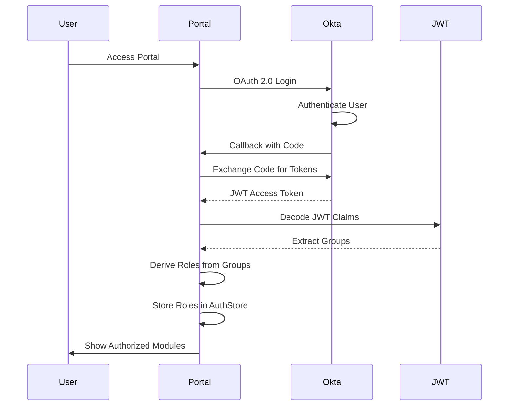
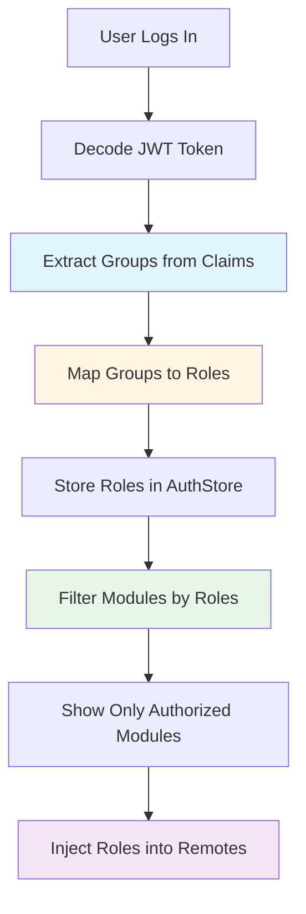

# RBAC with JWT Groups-to-Roles Guide

This guide explains how Role-Based Access Control (RBAC) works using OAuth 2.0 JWT tokens where **roles are derived from groups**.

## Overview

The portal uses **OAuth 2.0 JWT tokens** for authentication. **Groups from JWT claims** are mapped to **roles** for RBAC authorization. Groups have a direct relationship to roles in both the portal and remote packages.

## Key Concept

**Groups → Roles Mapping**
- JWT tokens contain **groups** (not roles)
- Groups are mapped to roles using `GROUP_TO_ROLE_MAP`
- Roles are derived from groups for RBAC
- Both portal and remotes use roles for authorization

## Architecture

### Authentication Flow



### Group-to-Role Mapping Flow



## JWT Token Structure

### Required Claims

The JWT access token contains **groups** (not roles):

```json
{
  "sub": "user-123",
  "email": "user@example.com",
  "name": "John Doe",
  "groups": ["trade-planners", "compliance-officers", "admins"],
  "exp": 1234567890,
  "iat": 1234567890
}
```

**Note:** The JWT token does NOT have a `roles` claim. Roles are derived from groups.

## Group-to-Role Mapping

### Mapping Configuration

```typescript
// packages/portal/src/config/oktaConfig.ts

/**
 * Group-to-Role Mapping
 * Maps Okta groups from JWT claims to roles for RBAC authorization
 */
export const GROUP_TO_ROLE_MAP: Record<string, string[]> = {
  // Trade Plans roles
  'trade-planners': ['trader'],
  'traders': ['trader'],
  'trade-managers': ['trade-manager'],
  
  // Client Verification roles
  'compliance-officers': ['compliance-officer'],
  'kyc-specialists': ['kyc-specialist'],
  
  // Annuity Sales roles
  'sales-agents': ['sales-agent'],
  'sales-managers': ['sales-manager'],
  
  // Admin role (maps to all module access)
  'admins': ['admin'],
}
```

### Role Derivation

```typescript
/**
 * Derives roles from groups based on GROUP_TO_ROLE_MAP
 */
export function deriveRolesFromGroups(groups: string[]): string[] {
  const roles = new Set<string>()
  
  groups.forEach(group => {
    const mappedRoles = GROUP_TO_ROLE_MAP[group]
    if (mappedRoles) {
      mappedRoles.forEach(role => roles.add(role))
    }
  })
  
  return Array.from(roles)
}
```

### Example Mapping

**User Groups:** `['trade-planners', 'admins']`

**Derived Roles:**
- `trade-planners` → `['trader']`
- `admins` → `['admin']`
- **Result:** `['trader', 'admin']`

## Portal Implementation

### 1. Okta Configuration

Request `groups` scope (not `roles`):

```typescript
// packages/portal/src/config/oktaConfig.ts
export const oktaAuth = new OktaAuth({
  clientId: import.meta.env.VITE_OKTA_CLIENT_ID,
  issuer: import.meta.env.VITE_OKTA_ISSUER,
  scopes: ['openid', 'profile', 'email', 'groups'], // ← Groups, not roles
  // ...
})
```

### 2. Extract Groups and Derive Roles

```typescript
// packages/portal/src/stores/AuthStore.ts
async loadUserData() {
  const accessToken = await this.oktaAuth.getAccessToken()
  if (accessToken) {
    this.claims = jwtDecode<JwtClaims>(accessToken)
    // Extract groups from JWT claims
    this.groups = this.claims.groups || []
    // Derive roles from groups (groups have direct relationship to roles)
    this.roles = deriveRolesFromGroups(this.groups)
  }
}
```

### 3. Module Access Configuration

Define required roles for each module:

```typescript
// packages/portal/src/config/oktaConfig.ts
export const MODULE_ACCESS = {
  tradePlans: ['trader', 'trade-manager', 'admin'],
  clientVerification: ['compliance-officer', 'kyc-specialist', 'admin'],
  annuitySales: ['sales-agent', 'sales-manager', 'admin'],
} as const
```

### 4. Filter Modules by Roles

```typescript
// packages/portal/src/components/Layout/Sidebar.tsx
const visibleNavItems = navItems.filter(item => {
  if (!item.requiredRoles || item.requiredRoles.length === 0) {
    return true
  }
  // Check if user has any of the required roles (derived from groups)
  return authStore.hasAnyRole(item.requiredRoles)
})
```

## Remote Module Implementation

### Receiving Roles from Portal

Remote modules receive roles (derived from groups) via props injection:

```typescript
// packages/trade-plans/src/App.tsx
import type { AppProps } from '@federation/shared/types'

export default function App(props: AppProps = {}) {
  const { auth } = props
  
  // Roles are derived from groups in the portal
  const roles = auth?.roles || [] // ['trader', 'admin']
  const groups = auth?.groups || [] // ['trade-planners', 'admins']
  
  // Use roles for authorization within remote
  const canCreateTrade = auth?.hasRole?.('trader') || auth?.hasRole?.('admin')
  const canViewAnalytics = auth?.hasRole?.('admin')
  
  return (
    <div>
      {canCreateTrade && <CreateTradeButton />}
      {canViewAnalytics && <AnalyticsDashboard />}
    </div>
  )
}
```

### Understanding the Relationship

**Groups (from JWT)** → **Roles (derived)** → **Authorization**

```
JWT Groups: ['trade-planners', 'admins']
    ↓
Derived Roles: ['trader', 'admin']
    ↓
Authorization: Can access Trade Plans, Client Verification, Annuity Sales
```

## Group-to-Role Mapping Examples

### Example 1: Single Group → Single Role

```typescript
'trade-planners' → ['trader']
'compliance-officers' → ['compliance-officer']
'sales-agents' → ['sales-agent']
```

### Example 2: Multiple Groups → Multiple Roles

```typescript
User Groups: ['trade-planners', 'compliance-officers']
    ↓
Derived Roles: ['trader', 'compliance-officer']
    ↓
Access: Trade Plans + Client Verification modules
```

### Example 3: Admin Group → Admin Role

```typescript
'admins' → ['admin']
    ↓
Access: All modules (admin role grants access to everything)
```

## Module Visibility

### Portal Sidebar

Only modules the user has required roles for are shown (roles derived from groups):

```typescript
// Sidebar automatically filters based on roles (derived from groups)
const visibleNavItems = navItems.filter(item => {
  if (!item.requiredRoles || item.requiredRoles.length === 0) {
    return true // No requirements = show to all
  }
  return authStore.hasAnyRole(item.requiredRoles) // Check derived roles
})
```

### Dashboard

Dashboard only shows accessible modules:

```typescript
// Dashboard filters modules by roles (derived from groups)
const accessibleModules = modules.filter(module =>
  authStore.hasAnyRole(module.requiredRoles)
)
```

## Role Configuration

### Defining Group-to-Role Mapping

```typescript
// packages/portal/src/config/oktaConfig.ts

export const GROUP_TO_ROLE_MAP: Record<string, string[]> = {
  // Trade Plans module groups → roles
  'trade-planners': ['trader'],
  'traders': ['trader'],
  'trade-managers': ['trade-manager'],
  
  // Client Verification module groups → roles
  'compliance-officers': ['compliance-officer'],
  'kyc-specialists': ['kyc-specialist'],
  
  // Annuity Sales module groups → roles
  'sales-agents': ['sales-agent'],
  'sales-managers': ['sales-manager'],
  
  // Admin group → admin role (grants access to all modules)
  'admins': ['admin'],
}
```

### Module Access Roles

```typescript
// Required roles for each module (roles are derived from groups)
export const MODULE_ACCESS = {
  tradePlans: ['trader', 'trade-manager', 'admin'],
  clientVerification: ['compliance-officer', 'kyc-specialist', 'admin'],
  annuitySales: ['sales-agent', 'sales-manager', 'admin'],
}
```

### Okta Group Configuration

In Okta, configure groups to be included in JWT tokens:

1. **Create Groups** in Okta Admin Console:
   - `trade-planners`
   - `traders`
   - `compliance-officers`
   - `kyc-specialists`
   - `sales-agents`
   - `sales-managers`
   - `admins`

2. **Assign Users** to groups

3. **Configure Authorization Server** to include groups in token claims:
   ```json
   {
     "name": "groups",
     "value": "user.groups",
     "type": "Expression",
     "valueType": "GROUPS"
   }
   ```

4. **Request Groups Scope** in OAuth flow (already configured)

## Example User Scenarios

### Scenario 1: Trader User

**JWT Claims:**
```json
{
  "groups": ["trade-planners"]
}
```

**Group-to-Role Mapping:**
- `trade-planners` → `['trader']`

**Derived Roles:** `['trader']`

**Access:**
- ✅ Trade Plans module (has `trader` role)
- ❌ Client Verification (no `compliance-officer` role)
- ❌ Annuity Sales (no `sales-agent` role)

**Portal Shows:**
- Dashboard
- Trade Plans (only)

### Scenario 2: Admin User

**JWT Claims:**
```json
{
  "groups": ["admins"]
}
```

**Group-to-Role Mapping:**
- `admins` → `['admin']`

**Derived Roles:** `['admin']`

**Access:**
- ✅ Trade Plans (has `admin` role)
- ✅ Client Verification (has `admin` role)
- ✅ Annuity Sales (has `admin` role)

**Portal Shows:**
- Dashboard
- Trade Plans
- Client Verification
- Annuity Sales

### Scenario 3: Multi-Group User

**JWT Claims:**
```json
{
  "groups": ["trade-planners", "compliance-officers"]
}
```

**Group-to-Role Mapping:**
- `trade-planners` → `['trader']`
- `compliance-officers` → `['compliance-officer']`

**Derived Roles:** `['trader', 'compliance-officer']`

**Access:**
- ✅ Trade Plans (has `trader` role)
- ✅ Client Verification (has `compliance-officer` role)
- ❌ Annuity Sales (no `sales-agent` role)

**Portal Shows:**
- Dashboard
- Trade Plans
- Client Verification

## Remote Module Authorization

### Using Roles in Remotes

```typescript
// packages/trade-plans/src/components/TradeList.tsx
export default function TradeList({ auth }: { auth?: AuthState }) {
  const { roles, groups } = auth || {}
  
  // Roles are derived from groups in the portal
  // Use roles for authorization (groups → roles → authorization)
  const canCreate = auth?.hasRole?.('trader') || auth?.hasRole?.('admin')
  const canEdit = auth?.hasRole?.('trader') || auth?.hasRole?.('trade-manager') || auth?.hasRole?.('admin')
  const canDelete = auth?.hasRole?.('admin')
  const canViewAnalytics = auth?.hasRole?.('admin')
  
  return (
    <div>
      {canCreate && <CreateTradeButton />}
      <TradeTable 
        trades={trades}
        canEdit={canEdit}
        canDelete={canDelete}
      />
      {canViewAnalytics && <AnalyticsPanel />}
    </div>
  )
}
```

### Understanding Groups vs Roles

**Groups** (from JWT):
- Come directly from Okta
- Stored in JWT token claims
- Used for group-based checks (if needed)

**Roles** (derived from groups):
- Derived using `GROUP_TO_ROLE_MAP`
- Used for RBAC authorization
- Consistent across portal and remotes

## Best Practices

### ✅ Do

1. **Use Roles for Authorization** - Use derived roles for RBAC decisions
2. **Map Groups Consistently** - Keep group-to-role mapping consistent
3. **Document Mapping** - Document group-to-role relationships
4. **Use Role Helpers** - Use `hasRole()`, `hasAnyRole()` helpers
5. **Validate Server-Side** - Always validate groups server-side for API calls

### ❌ Don't

1. **Don't Expect Roles in JWT** - JWT tokens don't have roles claim
2. **Don't Hardcode Groups** - Use role-based checks, not group checks
3. **Don't Mix Approaches** - Use roles consistently, not groups directly
4. **Don't Skip Mapping** - Always use `deriveRolesFromGroups()`

## Customizing Group-to-Role Mapping

### Adding New Groups

```typescript
// Add new group mapping
export const GROUP_TO_ROLE_MAP: Record<string, string[]> = {
  // ... existing mappings
  'new-group': ['new-role'],
}
```

### One-to-Many Mapping

```typescript
// One group can map to multiple roles
'power-users': ['trader', 'compliance-officer', 'sales-agent']
```

### Many-to-One Mapping

```typescript
// Multiple groups can map to same role
'trade-planners': ['trader'],
'traders': ['trader'], // Both map to 'trader' role
```

## Testing

### Mock Groups for Development

```typescript
// packages/portal/src/services/mockOktaService.ts
const mockUsers = {
  'trader@example.com': {
    groups: ['trade-planners'], // Groups in JWT
    // Roles will be derived: ['trader']
  },
  'admin@example.com': {
    groups: ['admins'], // Groups in JWT
    // Roles will be derived: ['admin']
  },
  'multi-group@example.com': {
    groups: ['trade-planners', 'compliance-officers'], // Groups in JWT
    // Roles will be derived: ['trader', 'compliance-officer']
  }
}
```

### Testing Role Derivation

```typescript
test('derives roles from groups', () => {
  const groups = ['trade-planners', 'admins']
  const roles = deriveRolesFromGroups(groups)
  
  expect(roles).toContain('trader')
  expect(roles).toContain('admin')
  expect(roles).toHaveLength(2)
})
```

## Troubleshooting

### Roles Not Showing

1. **Check Groups in JWT** - Verify `groups` claim exists in token
2. **Check Group Mapping** - Verify group exists in `GROUP_TO_ROLE_MAP`
3. **Check Derivation** - Verify `deriveRolesFromGroups()` is called
4. **Check Okta Configuration** - Ensure groups scope is requested

### Modules Not Visible

1. **Check User Groups** - Verify user has required groups in Okta
2. **Check Role Derivation** - Verify groups map to required roles
3. **Check Module Configuration** - Verify `MODULE_ACCESS` configuration
4. **Check Filter Logic** - Verify `hasAnyRole` logic is correct

### Remotes Not Receiving Roles

1. **Check Props Injection** - Verify `ModuleLoader` injects roles
2. **Check Role Derivation** - Verify roles are derived before injection
3. **Check AuthState Type** - Verify `roles` field exists in type
4. **Check Console** - Look for errors in browser console

## Summary

✅ **Portal uses OAuth 2.0 JWT tokens** for authentication  
✅ **Groups from JWT claims** are mapped to roles  
✅ **Roles are derived from groups** using `GROUP_TO_ROLE_MAP`  
✅ **Only authorized modules** are shown in portal  
✅ **Remotes receive roles** (derived from groups) via props injection  
✅ **Remotes use roles** for internal authorization  

## Key Points

1. **JWT tokens contain groups** (not roles)
2. **Groups are mapped to roles** using `GROUP_TO_ROLE_MAP`
3. **Roles are derived** from groups for RBAC
4. **Groups have direct relationship** to roles in portal and remotes
5. **Both portal and remotes** use roles for authorization

## Related Documentation

- [Security & Authentication Guide](./security-authentication-guide.md) - Complete auth setup
- [State Management Guide](./state-management-guide.md) - How roles flow to remotes
- [ADR-0002: Token Sharing](./adr/0002-token-sharing-props-injection.md) - Props injection strategy

---

**Last Updated:** 2024
