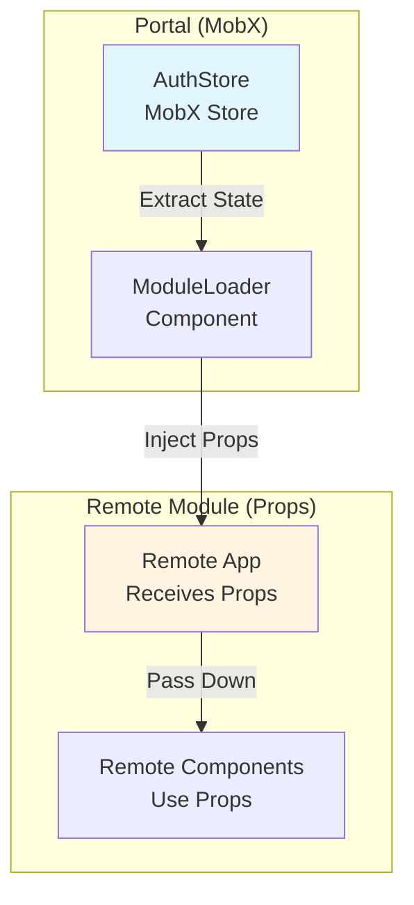

# State Management Guide

This guide explains how state management works across microfrontend packages in this project.

## Overview

**Yes, the project uses MobX**, but **only in the Portal**. Remote modules **do NOT need to use MobX** - they receive state via **props injection**.

## State Management Architecture

### Portal: Uses MobX

The Portal uses **MobX** for reactive state management:

```typescript
// packages/portal/src/stores/AuthStore.ts
import { makeAutoObservable } from 'mobx'

class AuthStore {
  isAuthenticated = false
  accessToken: string | null = null
  claims: JwtClaims | null = null
  groups: string[] = []
  
  constructor(private oktaAuth: OktaAuth) {
    makeAutoObservable(this)  // ← MobX makes this reactive
  }
  
  // ... methods
}
```

**Why MobX in Portal?**
- ✅ Reactive state updates
- ✅ Automatic re-renders when state changes
- ✅ Clean, simple API
- ✅ Works well with React via `mobx-react-lite`

### Remote Modules: Props-Based (MobX Optional)

Remote modules receive state via **props injection** from the portal. They can use MobX internally for their own state management, but they don't need MobX to access portal state:

```typescript
// packages/trade-plans/src/App.tsx
interface AppProps {
  auth?: {
    user?: any
    token?: string | null
    groups?: string[]
    roles?: string[]
    isAuthenticated?: boolean
    hasGroup?: (group: string) => boolean
    hasAnyGroup?: (groups: string[]) => boolean
    hasRole?: (role: string) => boolean
  }
  onLogout?: () => void
}

export default function App(props: AppProps = {}) {
  const { auth } = props
  // Use auth state directly from props
  
  // Note: Trade Plans module uses MobX internally (TradePlanStore)
  // for managing trade plan data, but portal auth state comes via props
  
  return (
    <div>
      {auth?.user?.name && <p>Welcome, {auth.user.name}</p>}
      {auth?.hasRole?.('trader') && <button>Create Trade Plan</button>}
    </div>
  )
}
```

## How State Flows

### State Flow Diagram



### Step-by-Step Flow

1. **Portal manages state** - AuthStore (MobX) holds authentication state
2. **ModuleLoader extracts state** - Reads from AuthStore
3. **Props are injected** - ModuleLoader passes state as props to remote
4. **Remote receives props** - Remote component receives auth state
5. **Remote uses props** - Remote uses props directly (no MobX needed)

## Portal State Management (MobX)

### MobX Stores in Portal

```typescript
// packages/portal/src/stores/AuthStore.ts
import { makeAutoObservable } from 'mobx'

class AuthStore {
  isAuthenticated = false
  accessToken: string | null = null
  claims: JwtClaims | null = null
  groups: string[] = []
  
  constructor(private oktaAuth: OktaAuth) {
    makeAutoObservable(this)  // Makes all properties reactive
  }
  
  async login() {
    // ... login logic
    this.isAuthenticated = true  // MobX automatically triggers re-renders
  }
  
  logout() {
    this.isAuthenticated = false
    this.accessToken = null
    // ... cleanup
  }
  
  hasGroup(group: string): boolean {
    return this.groups.includes(group)
  }
}
```

### Using MobX in Portal Components

```typescript
// packages/portal/src/components/ModuleLoader.tsx
import { observer } from 'mobx-react-lite'
import { useStores } from '../contexts/StoreContext'

export const ModuleLoader = observer(({ remoteName, module }) => {
  const { authStore } = useStores()  // ← Get MobX store
  
  // Extract state from MobX store
  const injectedProps = {
    auth: {
      user: authStore.claims,           // ← From MobX
      token: authStore.accessToken,      // ← From MobX
      groups: authStore.groups,          // ← From MobX
      isAuthenticated: authStore.isAuthenticated,  // ← From MobX
      hasGroup: (group: string) => authStore.hasGroup(group),
    },
    onLogout: () => authStore.logout(),
  }
  
  return <RemoteComponent {...injectedProps} />
})
```

**Key Points:**
- `observer()` wrapper makes component reactive to MobX changes
- When `authStore` changes, component automatically re-renders
- State is extracted and passed as props to remotes

## Remote Module State Management

### Option 1: No State Management (Recommended for Simple Cases)

For simple remotes that just display data:

```typescript
// packages/trade-plans/src/App.tsx
export default function App(props: AppProps = {}) {
  const { auth } = props
  
  // Just use props directly - no state management needed!
  return (
    <div>
      <h1>Welcome, {auth?.user?.name}</h1>
      <TradeList auth={auth} />
    </div>
  )
}
```

### Option 2: React useState/useReducer (For Local State)

For remotes that need local state:

```typescript
// packages/trade-plans/src/App.tsx
import { useState } from 'react'

export default function App(props: AppProps = {}) {
  const { auth } = props
  const [trades, setTrades] = useState([])  // ← Local state
  
  // Use React hooks for local state
  useEffect(() => {
    fetchTrades(auth?.token).then(setTrades)
  }, [auth?.token])
  
  return <TradeList trades={trades} />
}
```

### Option 3: MobX (Used by Trade Plans Module)

**The Trade Plans module uses MobX** for managing trade plan data:

```typescript
// packages/trade-plans/src/stores/TradePlanStore.ts
import { makeAutoObservable, runInAction } from 'mobx'
import axios from 'axios'

class TradePlanStore {
  tradePlans: TradePlan[] = []
  selectedTradePlan: TradePlan | null = null
  isLoading = false
  error: string | null = null
  
  constructor(apiBaseUrl?: string, authToken?: string) {
    makeAutoObservable(this)
    this.setupAxiosInterceptor(authToken)
  }
  
  async fetchTradePlans() {
    runInAction(() => {
      this.isLoading = true
      this.error = null
    })
    
    try {
      const response = await axios.get(`${this.apiBaseUrl}/trade-plans`)
      runInAction(() => {
        this.tradePlans = response.data.tradePlans || []
      })
    } catch (error) {
      runInAction(() => {
        this.error = error.message
      })
    } finally {
      runInAction(() => {
        this.isLoading = false
      })
    }
  }
}

// packages/trade-plans/src/components/TradePlanList.tsx
// Note: Uses manual reactivity (not observer wrapper) for Module Federation compatibility
import { useState, useEffect } from 'react'
import { reaction } from 'mobx'

function TradePlanList({ auth, store }: TradePlanListProps) {
  const [, forceUpdate] = useState({})
  
  // Subscribe to store changes manually using MobX reaction
  useEffect(() => {
    const disposer = reaction(
      () => ({
        tradePlans: store.tradePlans,
        isLoading: store.isLoading,
        error: store.error
      }),
      () => {
        forceUpdate({}) // Force re-render when store changes
      }
    )
    
    return () => disposer()
  }, [store])
  
  useEffect(() => {
    if (auth?.token) {
      store.setAuthToken(auth.token)
    }
    store.fetchTradePlans()
  }, [auth?.token])
  
  return <div>{/* Render trade plans */}</div>
}
```

**Important Note:** Trade Plans uses **manual reactivity** with MobX `reaction` instead of the `observer` wrapper. This avoids React null errors in Module Federation. See [Module Federation Guide](./module-federation-guide.md) for details.

## State Sharing Strategy: Props Injection

### Why Props Injection?

The project uses **Props Injection** instead of shared MobX stores:

**✅ Benefits:**
- **Type Safety** - TypeScript interfaces ensure type safety
- **Explicit Dependencies** - Clear contract between portal and remotes
- **Testability** - Easy to mock props in tests
- **No Global State** - Avoids global state pollution
- **Standalone Support** - Remotes can work without portal (for dev)
- **Framework Agnostic** - Remotes don't need to use MobX

**❌ Alternatives Considered (Rejected):**
- **Shared MobX Store** - Too much coupling
- **Global Window Object** - No type safety
- **Event-Based** - Too complex

### How Props Injection Works

```typescript
// Portal side (ModuleLoader.tsx)
const injectedProps = {
  auth: {
    user: authStore.claims,              // From MobX store
    token: authStore.accessToken,         // From MobX store
    groups: authStore.groups,             // From MobX store
    isAuthenticated: authStore.isAuthenticated,
    hasGroup: (group: string) => authStore.hasGroup(group),
    hasAnyGroup: (groups: string[]) => authStore.hasAnyGroup(groups),
    hasRole: (role: string) => authStore.hasRole(role),
  },
  onLogout: () => authStore.logout(),
}

<RemoteComponent {...injectedProps} />
```

```typescript
// Remote side (App.tsx)
export default function App(props: AppProps = {}) {
  const { auth } = props
  
  // Use auth for API calls
  const response = await fetch('/api/trades', {
    headers: {
      'Authorization': `Bearer ${auth?.token}`
    }
  })
  
  // Use auth for authorization
  if (auth?.hasGroup?.('traders')) {
    // Show trader features
  }
  
  return <div>...</div>
}
```

## Do Remotes Need to Worry About State Management?

### Short Answer: **No, not for portal state**

Remotes **do NOT need to worry about**:
- ❌ Managing authentication state
- ❌ Managing user information
- ❌ Managing tokens
- ❌ Portal's MobX stores

Remotes **DO need to handle**:
- ✅ Receiving props from portal
- ✅ Using props for API calls
- ✅ Using props for authorization
- ✅ Their own local state (if needed)

### What Remotes Should Do

```typescript
// ✅ GOOD: Accept and use props
export default function App(props: AppProps = {}) {
  const { auth } = props
  
  // Use auth token for API calls
  const fetchData = async () => {
    const response = await fetch('/api/data', {
      headers: {
        'Authorization': `Bearer ${auth?.token}`
      }
    })
  }
  
  // Use auth for authorization
  const canEdit = auth?.hasGroup?.('editors')
  
  return <div>...</div>
}
```

```typescript
// ❌ BAD: Don't try to access portal stores directly
export default function App() {
  // Don't do this - portal stores aren't accessible
  const authStore = useStores()  // ❌ Won't work!
  
  return <div>...</div>
}
```

## Shared Dependencies: MobX

### MobX is Shared (But Optional)

MobX is configured as a **shared dependency** in Module Federation:

```typescript
// vite.config.ts
shared: {
  'mobx': { singleton: true },
  'mobx-react-lite': { singleton: true }
}
```

**What this means:**
- ✅ MobX is loaded once and shared across all modules
- ✅ Remotes can use MobX if they want
- ✅ Remotes don't have to use MobX
- ✅ No duplicate MobX bundles

**Remotes can:**
- Use MobX for their own local state
- Use React hooks instead
- Use any state management library
- Use no state management at all

## State Management Patterns

### Pattern 1: Simple Props (Most Common)

```typescript
// Remote receives props, uses directly
export default function App(props: AppProps = {}) {
  const { auth } = props
  return <div>Welcome, {auth?.user?.name}</div>
}
```

### Pattern 2: Props + Local State

```typescript
// Remote uses props + React hooks for local state
export default function App(props: AppProps = {}) {
  const { auth } = props
  const [data, setData] = useState([])
  
  useEffect(() => {
    fetchData(auth?.token).then(setData)
  }, [auth?.token])
  
  return <DataList data={data} />
}
```

### Pattern 3: Props + MobX (Optional)

```typescript
// Remote uses props + MobX for complex local state
import { observer } from 'mobx-react-lite'

export default observer(function App(props: AppProps = {}) {
  const { auth } = props
  const localStore = new LocalStore()
  
  useEffect(() => {
    localStore.loadData(auth?.token)
  }, [auth?.token])
  
  return <DataList data={localStore.data} />
})
```

### Pattern 4: Props + Context (For Deep Trees)

```typescript
// Create context for auth props to avoid prop drilling
const AuthContext = createContext<AppProps['auth']>(null)

export default function App(props: AppProps = {}) {
  return (
    <AuthContext.Provider value={props.auth}>
      <DeepComponentTree />
    </AuthContext.Provider>
  )
}

// Deep components can access auth via context
function DeepComponent() {
  const auth = useContext(AuthContext)
  return <div>{auth?.user?.name}</div>
}
```

## Best Practices

### ✅ Do

1. **Accept props** - Always accept `AppProps` in remote App component
2. **Handle missing props** - Use optional chaining (`auth?.token`)
3. **Use props for API calls** - Use injected token for authentication
4. **Use props for authorization** - Use `hasGroup()` methods
5. **Manage local state** - Use React hooks or MobX for module-specific state

### ❌ Don't

1. **Don't access portal stores** - Portal stores aren't accessible from remotes
2. **Don't assume props exist** - Always handle standalone mode (no props)
3. **Don't store auth state** - Don't duplicate auth state in remotes
4. **Don't use global state** - Avoid `window` object for state sharing

## Examples

### Example 1: Simple Remote (No State Management)

```typescript
// packages/trade-plans/src/App.tsx
export default function App(props: AppProps = {}) {
  const { auth } = props
  
  return (
    <div>
      <h1>Trade Plans</h1>
      {auth?.user && <p>Welcome, {auth.user.name}</p>}
      <TradeList />
    </div>
  )
}
```

### Example 2: Remote with Local State

```typescript
// packages/trade-plans/src/App.tsx
import { useState, useEffect } from 'react'

export default function App(props: AppProps = {}) {
  const { auth } = props
  const [trades, setTrades] = useState([])
  const [loading, setLoading] = useState(false)
  
  useEffect(() => {
    if (!auth?.token) return
    
    setLoading(true)
    fetch('/api/trades', {
      headers: {
        'Authorization': `Bearer ${auth.token}`
      }
    })
      .then(res => res.json())
      .then(setTrades)
      .finally(() => setLoading(false))
  }, [auth?.token])
  
  if (loading) return <div>Loading...</div>
  
  return <TradeList trades={trades} />
}
```

### Example 3: Remote with MobX (Optional)

```typescript
// packages/trade-plans/src/stores/TradeStore.ts
import { makeAutoObservable } from 'mobx'

class TradeStore {
  trades = []
  isLoading = false
  
  constructor() {
    makeAutoObservable(this)
  }
  
  async loadTrades(token: string) {
    this.isLoading = true
    try {
      const response = await fetch('/api/trades', {
        headers: { 'Authorization': `Bearer ${token}` }
      })
      this.trades = await response.json()
    } finally {
      this.isLoading = false
    }
  }
}

// packages/trade-plans/src/App.tsx
import { observer } from 'mobx-react-lite'
import { TradeStore } from './stores/TradeStore'

export default observer(function App(props: AppProps = {}) {
  const { auth } = props
  const [tradeStore] = useState(() => new TradeStore())
  
  useEffect(() => {
    if (auth?.token) {
      tradeStore.loadTrades(auth.token)
    }
  }, [auth?.token, tradeStore])
  
  if (tradeStore.isLoading) return <div>Loading...</div>
  
  return <TradeList trades={tradeStore.trades} />
})
```

## Summary

### Portal State Management
- ✅ **Uses MobX** for reactive state management
- ✅ Manages authentication state in `AuthStore`
- ✅ Extracts state and injects as props to remotes

### Remote State Management
- ✅ **Do NOT need MobX** (but can use it if desired)
- ✅ Receive state via **props injection**
- ✅ Can use React hooks, MobX, or any state management
- ✅ Manage their own local state independently

### State Sharing
- ✅ **Props Injection** - Portal passes state as props
- ✅ **Type Safe** - TypeScript interfaces ensure correctness
- ✅ **Explicit** - Clear contract between portal and remotes
- ✅ **No Coupling** - Remotes don't depend on portal's MobX stores

### Key Takeaways

1. **Portal uses MobX** - For reactive state management
2. **Remotes receive props** - No MobX required (but optional)
3. **State flows one way** - Portal → Remotes via props
4. **Remotes manage local state** - Independently, using any approach
5. **MobX is shared** - Available if remotes want to use it

## Related Documentation

- [ADR-0002: Token Sharing Strategy](./adr/0002-token-sharing-props-injection.md) - Architecture decision
- [Architecture Overview - State Management](./architecture-overview.md#state-management) - High-level overview
- [Module Federation Guide - State Sharing](./module-federation-guide.md#state-sharing-between-portal-and-remotes) - Technical details

---

**Last Updated:** 2024

